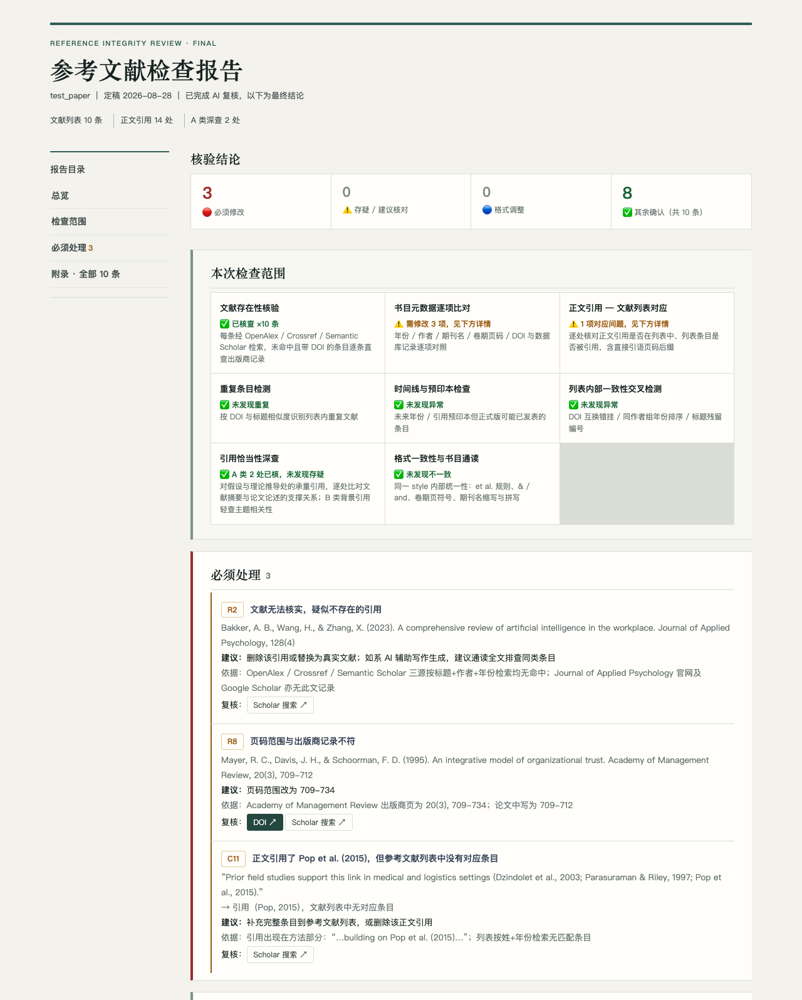

<div align="center">


**[English](README.en.md)** · 中文

[](LICENSE)
[](ob-reference-check/scripts/requirements.txt)
[](#-%E5%BF%AB%E9%80%9F%E5%BC%80%E5%A7%8B)
[](#-faq)

</div>

> [!NOTE]
> **这是给谁的？** 你用 AI 辅助写论文（现在谁不是呢），投稿前需要确认参考文献没有假文献、元数据错误或不当引用。人工逐条核对上百条文献要花一整天，还容易漏。**ob-reference-check 让 AI 助手把这件事系统做完**——8 类检查、三大学术数据库交叉验证，最后给你一份"必须修改哪几条"的清单。

---

## 🚨 为什么需要

AI 辅助写作的幻觉会生成**看起来完全真实的假文献**：作者、年份、期刊、卷期页码一应俱全，唯独这篇论文不存在。这类问题一旦进入投稿：

- **期刊直接拒稿**——审稿人随手一查就会发现
- **学术诚信风险**——已有研究者因 AI 编造文献被辞退的先例

即使文献是真的，还可能有：页码抄错、期刊名拼写错误、正文引用了列表里没有的文献、引用的文献其实并不支撑你的论述。**人工核对费时费力，且恰恰是最容易被跳过的环节。**

## ✨ 核心能力

|     | 能力                 | 对你意味着什么                                                                                      |
| --- | -------------------- | --------------------------------------------------------------------------------------------------- |
| 🔍  | **8 类检查一次跑完** | 存在性、元数据、正文对应、重复、时间线、preprint、列表交叉、引用恰当性——[具体查什么见下方](#checks) |
| 🧠  | **AI 编造文献拦截**  | 每条文献在 OpenAlex / Crossref / Semantic Scholar 三源交叉验证，假引用无处遁形                      |
| ⚖️  | **引用恰当性深查**   | 不只查"文献存在"，还比对摘要与你的论述——文献是真的但**不支撑你的观点**同样危险                      |
| 📄  | **直接读你的论文**   | .docx / .pdf / .md 都行，解析参考文献列表和正文引用，不用先转格式                                   |
| 🈵  | **免费、无需注册**   | 用公开学术 API，不申请 key 也能跑完整检查                                                           |
| 📋  | **行动导向的报告**   | 最终报告只告诉你"必须修改哪几条、改成什么"，其余 8 类确认项一目了然                                 |

## 🔍 具体查什么：8 类检查清单

<a id="checks"></a>

每一类检查都从"帮你拦住什么风险"出发设计——前 6 类由脚本自动完成（免费、零 token），第 7–8 类由 AI 判断：

| #   | 检查类别              | 具体查什么                                                                                                 | 帮你拦住什么                                                          |
| --- | --------------------- | ---------------------------------------------------------------------------------------------------------- | --------------------------------------------------------------------- |
| 1   | **存在性核实**        | 每条文献在 OpenAlex / Crossref / Semantic Scholar 三源交叉检索；未命中的由 AI 查出版商页二次复核后才下结论 | **AI 编造的假文献**——作者、年份、期刊、页码全都像真的，唯独论文不存在 |
| 2   | **元数据逐项比对**    | 作者、年份、期刊名、卷、期、页码、DOI 逐字段与数据库记录比对                                               | 页码写错、期刊名拼错（Review vs Reviews）、年份不符                   |
| 3   | **正文—列表双向对应** | 正向：正文引用了、列表里没有；反向：列表里有、正文从未引用                                                 | 补写段落时随手引了一篇、忘了加进列表——审稿人一眼就能看到              |
| 4   | **重复条目**          | 同一文献在列表中重复出现                                                                                   | 复制粘贴段落时带进来的重复                                            |
| 5   | **时间线与预印本**    | 出版年份晚于当前年份（不可能存在）；引用 preprint 而正式版可能已发表                                       | AI 幻觉常"发明"未来年份；preprint 引用被要求更新为正式版              |
| 6   | **列表内交叉检测**    | 两条文献 DOI 互换错挂；同作者多条排序、同年 a/b 后缀；标题残留章节编号                                     | DOI 错挂会把你引向别人的论文；排序是格式审查常见扣分点                |
| 7   | **引用恰当性**        | 假设/推导句中的承重引用逐条深查：摘要是否支撑论述、结论方向是否一致、构念是否对齐；背景性提及轻查          | **真文献但不支撑你的论点**——论文说正相关、文献其实是负相关，同样致命  |
| 8   | **格式一致性**        | et al. 规则、`&` vs `and`、年份括号、卷期斜体、页码符号（- vs –）、期刊缩写混用                            | 只查"自相矛盾"，不强推特定 style——你的论文未必是 APA                  |

> 📖 **为什么"自动未命中"不等于"假文献"？** 检索可能因数据库收录延迟（近 3 个月新文献）、在线发表版本而未命中。脚本只报"未匹配"，AI 复核后仍找不到才标"无法核实"——报告永远不会替你断言"这条是编造的"，但也绝不会静默放过。

## 📊 报告长这样

一次检查后，你会得到一份自包含 HTML 报告（示例来自内置测试论文，[你自己也能跑](#manual-run)）：



概览卡片直接给出**必须修改 3 条 / 存疑 0 / 格式 0 / 其余 8 条确认无误**。示例中三类典型问题各占一条：假文献（AI 编造的引用）、页码错误、正文引用了但列表里没有——每条问题带证据（数据库记录是什么、你的论文写的是什么）和修改建议，附 DOI 与 Google Scholar 一键复核链接。

## 🚀 快速开始

> ⏱️ **1 分钟安装，说一句话开始检查**

**方式一：告诉 AI 助手安装（最简单）**

复制粘贴到你的 AI 助手（Claude Code、Codex、Gemini CLI 等都适用）：

```
请帮我安装这个 Skill：https://github.com/gtskevin/ob-reference-check
安装后告诉我它能做什么。
```

**方式二：GitHub CLI**

```bash
# Claude Code
gh skill install gtskevin/ob-reference-check ob-reference-check --agent claude-code --scope user

# Codex
gh skill install gtskevin/ob-reference-check ob-reference-check --agent codex --scope user
```

**方式三：手动安装**

```bash
git clone https://github.com/gtskevin/ob-reference-check.git
# Claude Code
cp -r ob-reference-check/ob-reference-check ~/.claude/skills/
# Codex
cp -r ob-reference-check/ob-reference-check ~/.codex/skills/
```

<a id="manual-run"></a>

**不想用 AI 助手？** 脚本可以独立跑完机械检查（8 类中的 6 类），只需 Python 3.9+：

```bash
cd ob-reference-check
python3 -m venv .venv && .venv/bin/pip install -r ob-reference-check/scripts/requirements.txt
.venv/bin/python ob-reference-check/scripts/refcheck.py 你的论文.docx   # 也支持 .pdf / .md
```

产出（论文同目录）：`你的论文_refcheck_YYYYMMDD.html`（初筛底稿）和 `.json`（结构化数据）。引用恰当性深查和格式一致性审查需要 AI 层判断——这正是装成 skill 的价值。想先看效果，可以直接跑内置测试论文 `tests/fixtures/test_paper.md`。

**安装完成后，告诉你的 AI 助手：**

> 「检查这篇论文的参考文献：我的论文.docx」

AI 会自动完成全部检查并打开报告。整个过程不需要写任何代码，报告语言跟随你的提问语言。

## ⚙️ 它是怎么工作的

设计核心：**机械检查交给脚本（零 token、可复现、免费），AI 只做机器做不了的判断**。

```
你的论文 (.docx/.pdf/.md)
   │
   ▼
① 脚本机械初筛（免费、零 token）
   解析参考文献列表 + 正文引用
   ├─ 存在性：每条文献在 OpenAlex / Crossref / Semantic Scholar 三源轮换检索
   ├─ 元数据：作者/年份/期刊/卷期页码/DOI 逐项与数据库记录比对
   ├─ 双向对应：正文引用 ↔ 列表条目互相匹配（含直接引语页码）
   ├─ 重复条目 / 时间线异常 / preprint 版本
   └─ 列表内交叉：DOI 互换错挂、同作者排序、标题残留编号
   │
   ▼
② AI 复核与深查
   ├─ 异常二次复核：初筛"未匹配"≠"文献不存在"，AI 查出版商页确认后再下结论
   ├─ 引用恰当性：比对"你引用时说了什么" vs "文献摘要实际研究什么"
   │   按 A/B/C 分诊——假设推导句逐条深查，背景性提及轻查，引用堆砌只查真伪
   └─ 格式一致性：et al. 规则、&/and、期刊缩写等内部统一性
   │
   ▼
③ 最终报告（HTML）
   必须修改 N 条（带证据+建议） / 存疑核对 / 格式调整 / 其余确认
```

几个值得一提的细节：

- **结论必须有证据**：写入报告的每条结论都要求"判定 + 证据 + 修改建议"三要素，宁可标"存疑待人工核对"也不武断——漏报比误报代价高
- **三源轮换分摊额度**：百条文献的大论文，免费额度摊到三个数据库；某源限流自动熔断，剩余源接管
- **全局缓存**：`~/.reference_check/cache/`，改稿重查秒命中已验证文献
- **结论回流**：你复核过的结论按 DOI 记忆，下次检查同一批文献自动沿用

## 🤔 与其他方式对比

|                  | 人工逐条核对          | 直接问 ChatGPT 等                | ob-reference-check                          |
| ---------------- | --------------------- | -------------------------------- | ------------------------------------------- |
| 假文献识别       | 能，但 100 条要数小时 | ❌ AI 凭"记忆"回答，本身就会幻觉 | ✅ 三源数据库实时检索                       |
| 元数据比对       | 容易疲劳漏检          | ❌ 不联网查库时不可靠            | ✅ 逐项自动比对                             |
| 引用是否支撑论述 | ✅ 需要真读原文       | 部分，但无系统流程               | ⚠️ 摘要级比对（见[已知限制](#limitations)） |
| 正文-列表对应    | ✅ 费时               | ❌ 长文本容易漏                  | ✅ 自动双向匹配                             |
| 成本             | 你的一整天            | 订阅费                           | 订阅费 + 免费学术 API                       |
| 可复现性         | 因人而异              | 每次回答不同                     | ✅ 脚本初筛完全可复现                       |

> 诚实说明：这个工具**不能替代你读原文**。恰当性判断基于摘要，标"存疑"的条目请人工读原文确认——它把需要你花时间的地方精确圈出来了。

<a id="limitations"></a>

## ⚠️ 已知限制

- 条目解析覆盖 author-year 类 style（APA / Harvard 等），解析失败的条目由 AI 层兜底或提示人工核对
- 引用恰当性判断基于**摘要**，不含全文
- 新发表文献（<3 个月）可能未被数据库收录——报告标"无法验证"而非"编造"，不会冤枉真文献
- 扫描版 PDF（无文字层）会明确报错，不会假装检查过

## ❓ FAQ

**我的论文会被上传到哪里？**

不会上传论文本身。脚本只把**单条文献的元数据**（标题/作者/年份）发送给公开学术数据库 API 做检索，正文内容在你的机器上本地解析。最终报告也是本地 HTML 文件，不存在云端。

**真的不需要申请 API key 吗？**

不需要。OpenAlex 和 Crossref 的公开接口完全免费。如果设置了 `OPENALEX_API_KEY` / `SEMANTIC_API_KEY` 环境变量，命中率会更高、更稳定，但纯可选项。

**我不是组织行为学方向的，能用吗？**

能。工具本身不限学科——所有检查（存在性、元数据、对应关系、格式）对任何带参考文献列表的论文都有效。引用恰当性的判断示例偏管理/心理学的理论表述，但原理通用。

**检查一篇论文大概要多久/多少钱？**

脚本初筛通常几分钟内完成（取决于文献数量和网络），不消耗 AI token。AI 复核阶段消耗的 token 取决于异常条目数量——大部分文献一次查过、结论缓存复用，重复检查很便宜。

**AI 说某条文献"无法核实"，我该怎么办？**

报告会给出建议：通常是删除或替换该引用。如果你确信文献存在（比如非常新），点报告里的 Google Scholar 链接人工确认——报告的设计就是让你 30 秒内完成一条的人工复核。

## 📄 License

[MIT](LICENSE)

## 🙏 致谢

数据来源：[OpenAlex](https://openalex.org) · [Crossref](https://www.crossref.org) · [Semantic Scholar](https://www.semanticscholar.org)
